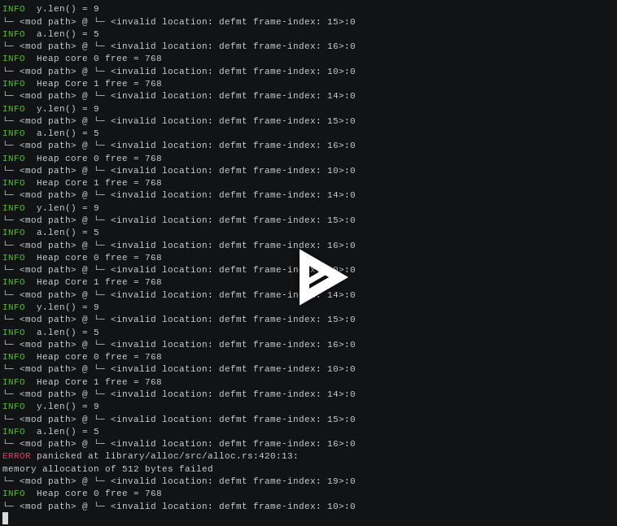

# Embedded Rust and Embassy and allocating memory

no_std needs a memory allocator once you use certain features of Rust, e.g. Vec\<T\>'s.
By default Embassy on RP2040 does not provide those causing errors like

`error: no global memory allocator found but one is required`


## Hardware Requirements

* RP2040. I use a Cytron Maker Pi RP2040.
* RPi Pico Probe for downloading and status messages from the RP2040

## Software Requirements

* Install target compiler:

```
$ rustup target add thumbv6m-none-eabi
```

* To use the Pico probe:

```
$ cargo binstall probe-rs
```

* To use various tools, e.g. to see the code size of the generated ELF (e.g. `cargo size`):

```
$ cargo binstall cargo-binutils
$ cargo size --release
    Finished `release` profile [optimized] target(s) in 0.05s
   text    data     bss     dec     hex filename
  23784       0  105284  129068   1f82c rp-alloc
```

## Running it

`cargo run` is all you need. You'll get a log of messages via the Pico probe:




